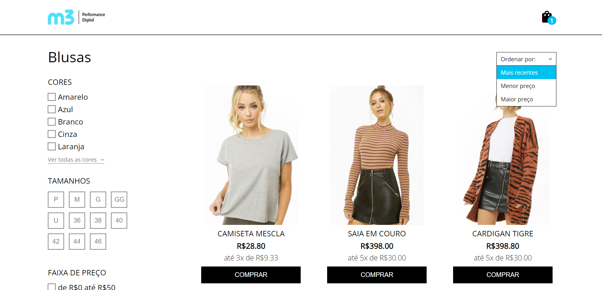
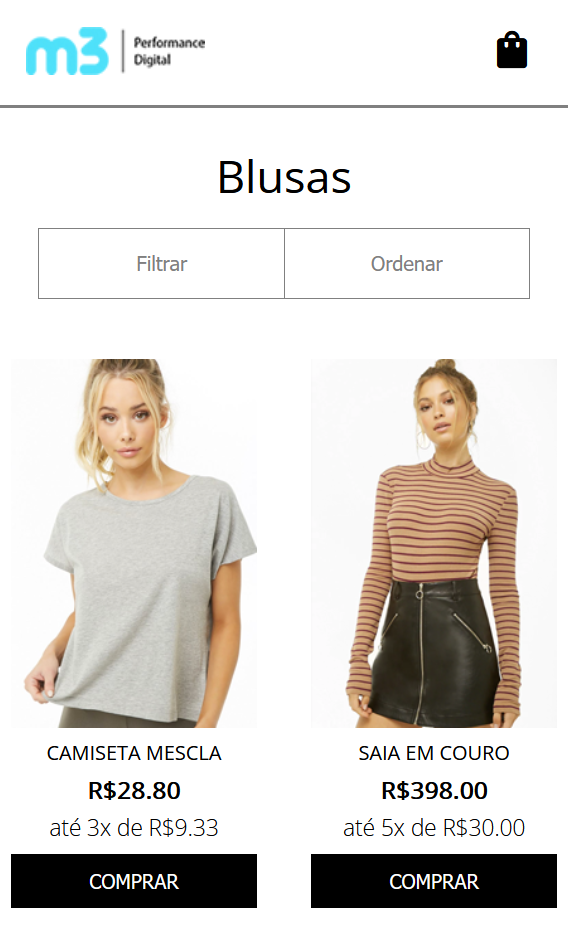
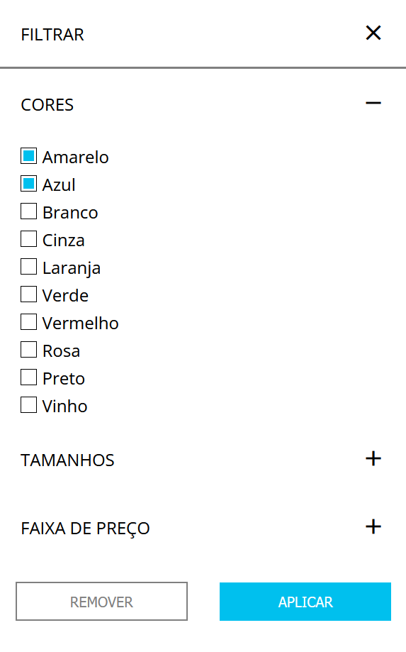

### Instruções para execução

- Clone o repositório
- Execute `npm install` na pasta onde foi salvo
- Execute `npm start`
- No navegador abra `http://localhost:3000`

A construção do site segue o design disponível na pasta layout

## Email para contato: sassa.sampaio@gmail.com
