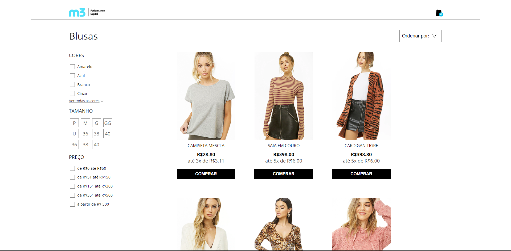
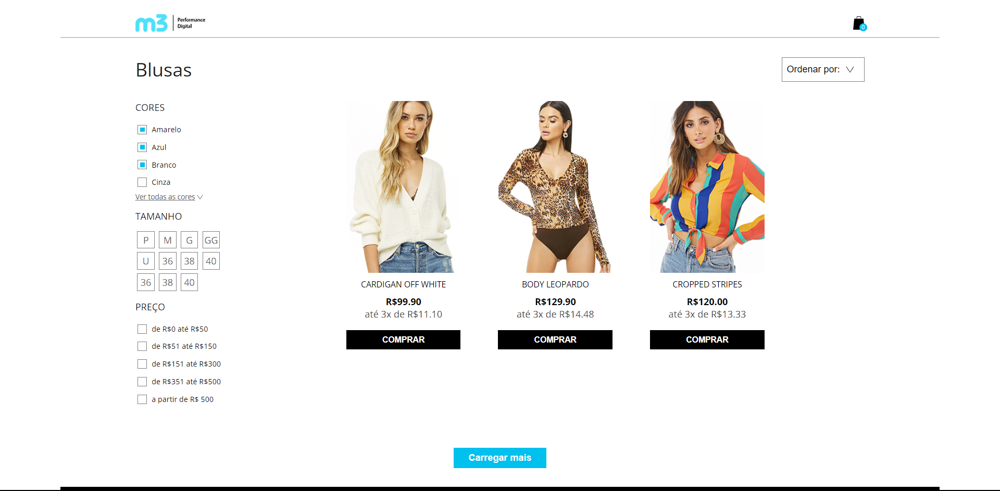
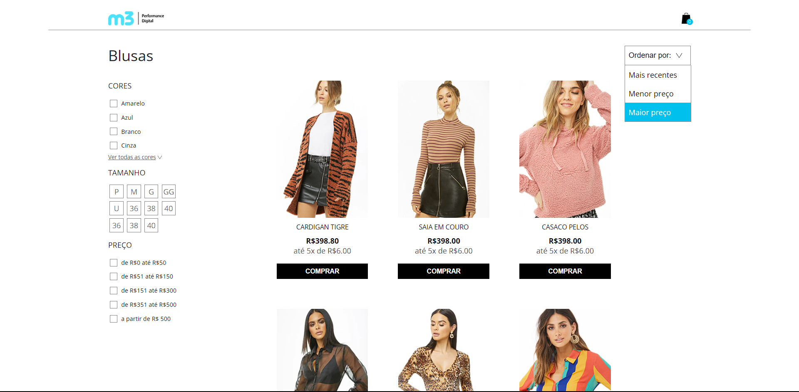
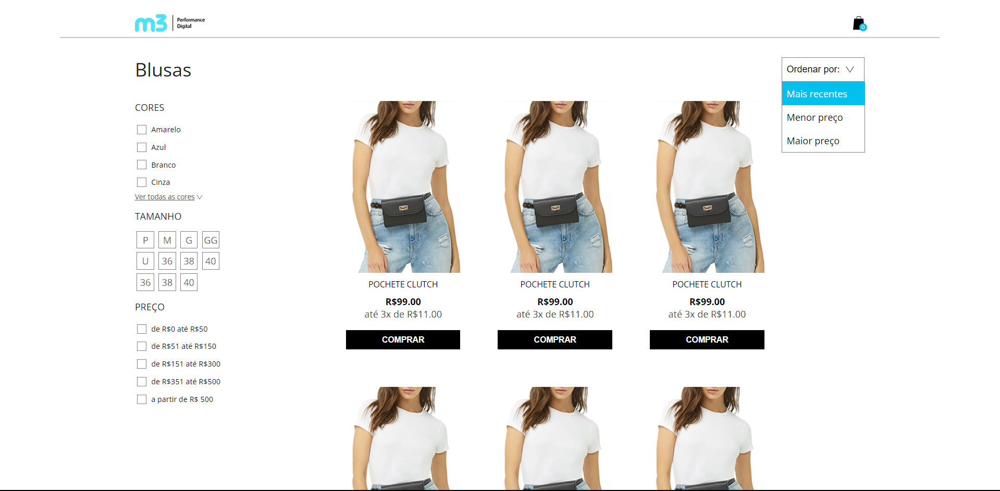
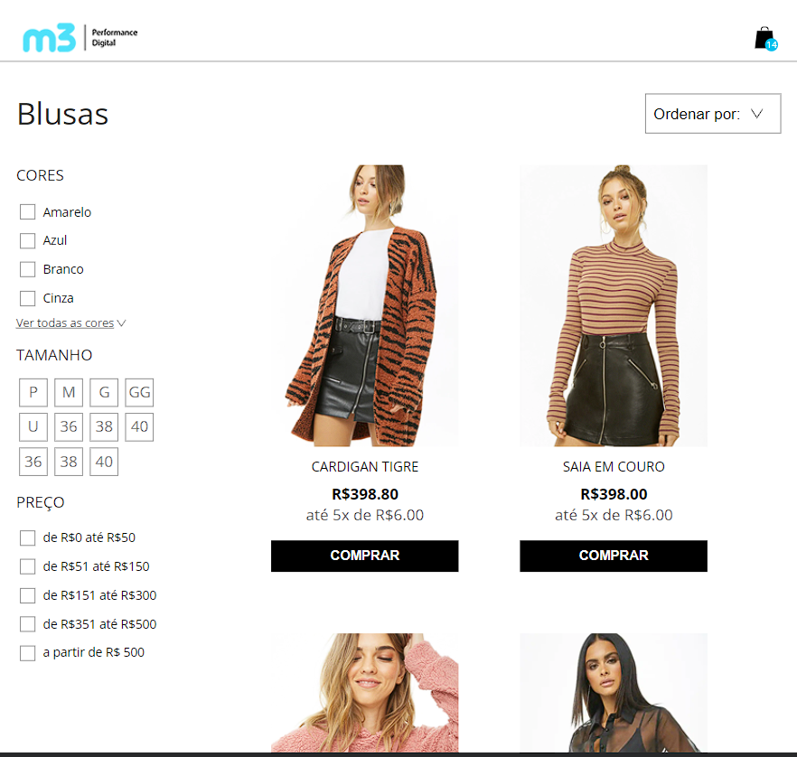
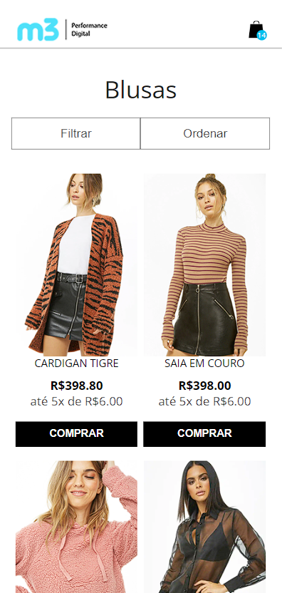
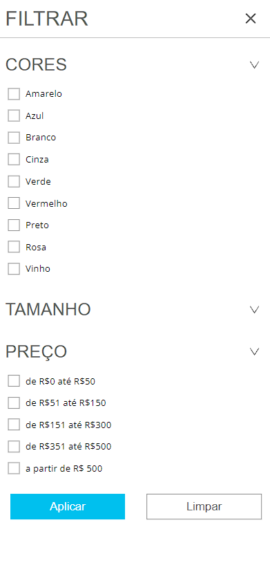
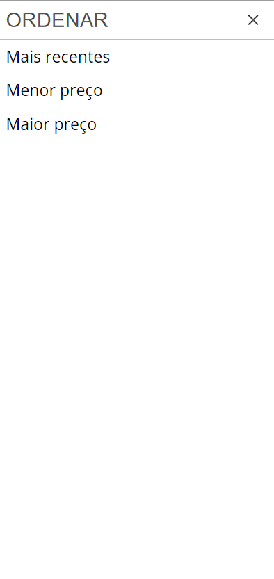

# Desafio da Digital M3

### Proposta do desafio
O objetivo desse desafio é avaliar a seus conhecimentos fundamentais de ``Front end``, por isso pedimos que não utilize nenhum framework, porem caso deseje utilizar frameworks como react, é possível adicionar ao setup.

### Nota
O objetivo desse desafio é avaliar a seus conhecimentos fundamentais de Front end, por isso pedimos que não utilize nenhum framework, porem caso deseje utilizar frameworks como react, é possível adicionar ao setup.

### Requisitos obrigatórios
- HTML5 e CSS3
- Typescript
- Requisição a API para obter os produtos
- Funcionalidade: Filtrar produtos por cor, tamanho e preço.
- Funcionalidade: Adicionar produto ao carrinho.
- Funcionalidade: Carregar mais produtos.
- Não utilizar Bootstrap, Foundation Css, Semantic ui ou semelhantes ;
- Responsividade

### Figma dado pela empresa
O layout se encontra no [figma](https://www.figma.com/file/hPfcV6VClVfkHCtje9997Q/Desafio-m3?node-id=0%3A1) e pode ser encontrado images dele em "layout".

## Layout web
 

## Layout mobile

 

## 🛠️ Tecnologias

💻 **Front-end**
- [Javascript](https://developer.mozilla.org/pt-BR/docs/Web/JavaScript)
- [Typescript](https://www.typescriptlang.org)

🎨 **Estilização**
- [Sass](https://sass-lang.com/guide/)

🔋 **Versionamento e Deploy**
- [Git](https://git-scm.com)

⚙️ **Configuranções e Instalações**

Clone do Projeto 

    $ gir clone https://github.com/renovatt/Desenvolvedor-M3.git

Branch 

    $ feat/renovatt-dev

Instalando as dependências

    $ npm install

Iniciando o projeto

    $ npm start

**E-mail**: wlymes@gmail.com

**Autor** [Wildemberg Renovato de Lima](https://www.linkedin.com/in/renovatt/)