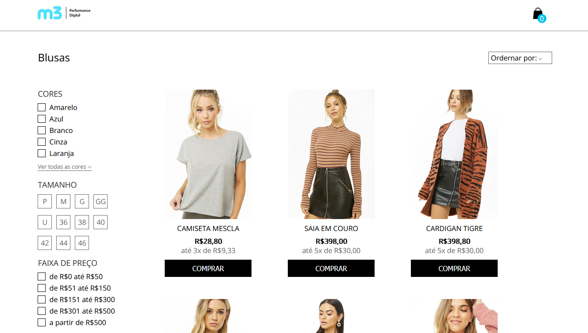
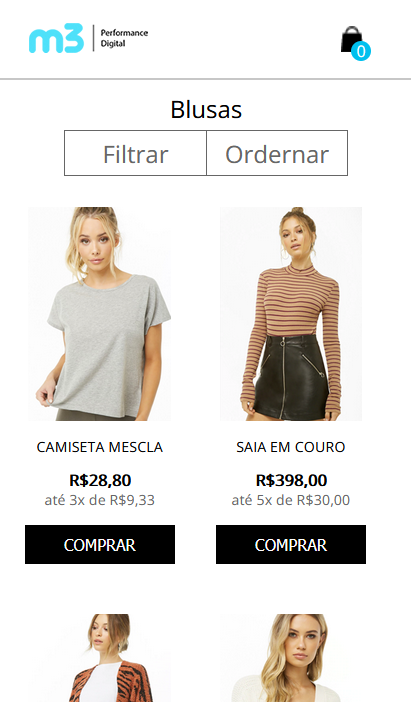

# Projeto Desenvolvedor M3

## Para executar o projeto, deve-se:
 - Clonar o repositório da aplicação.
 - Ir na pasta onde foi salvo.
 - Executar o comando `npm install` para instalar as dependências.
 - Executar o comando `npm start`.
 - Abrir "localhost:3000/" no navegador.

### Email para contato: wanderleysr@id.uff.br