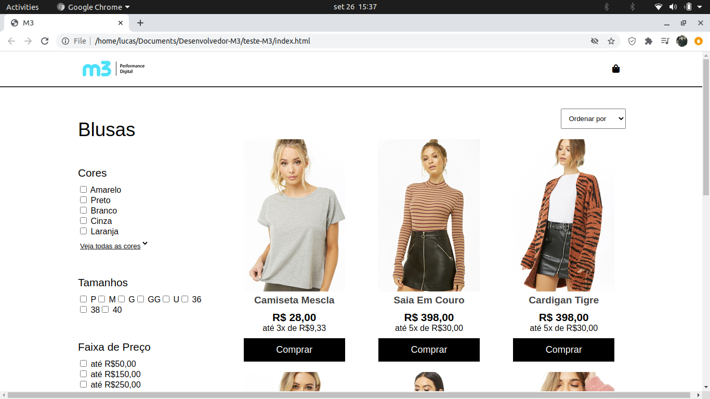

# Resposta ao teste para desenvolvedor front-end na Digital M3

## Para rodar:

Para rodar basta rodar um npm start na pasta backend e abrir o index.html

## email: lucascarber@gmail.com

Partes do teste ficaram incompletas, porem agradeço a oportunidade de crescimento oferecida, acabei aprendendo muito ao por a mão na massa e codar para valer.

